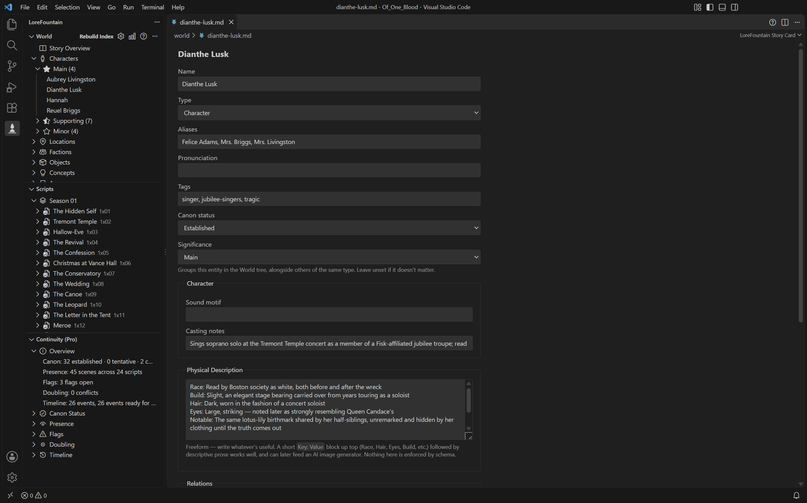
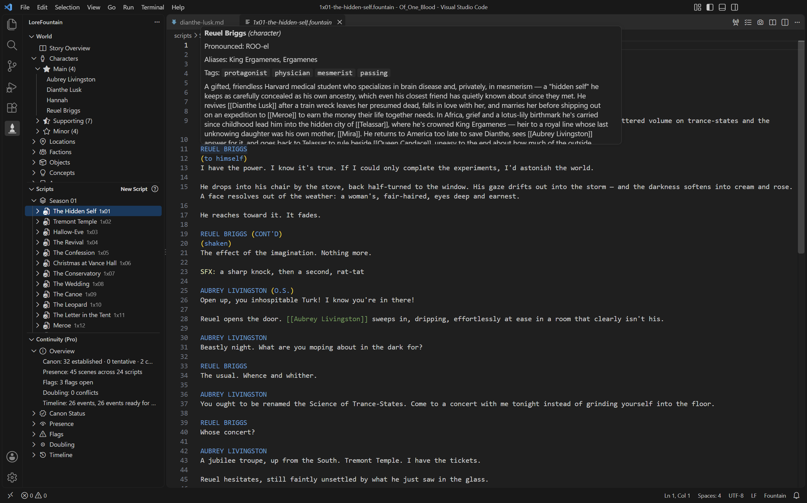
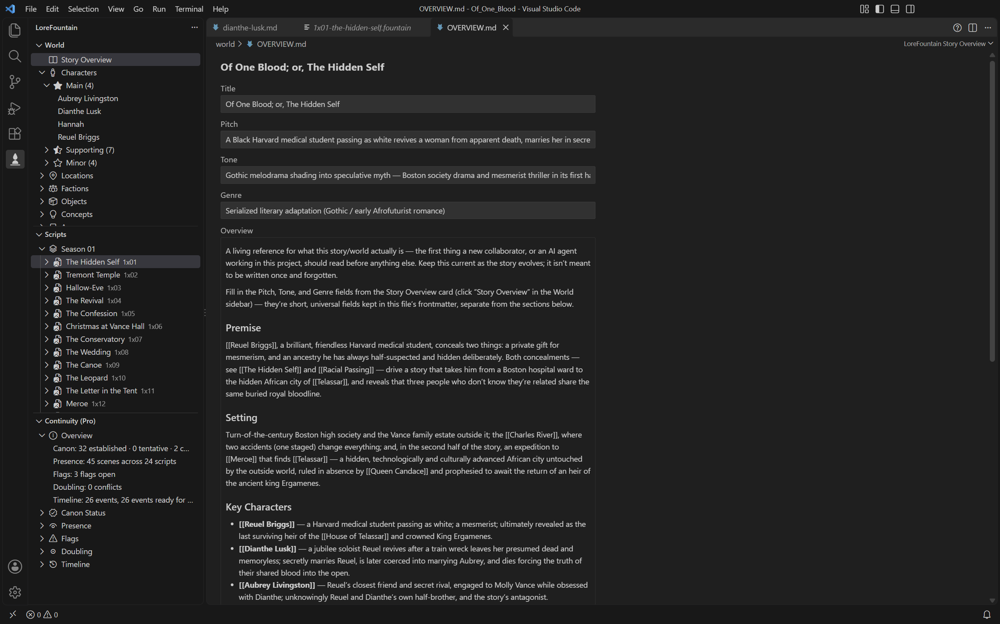
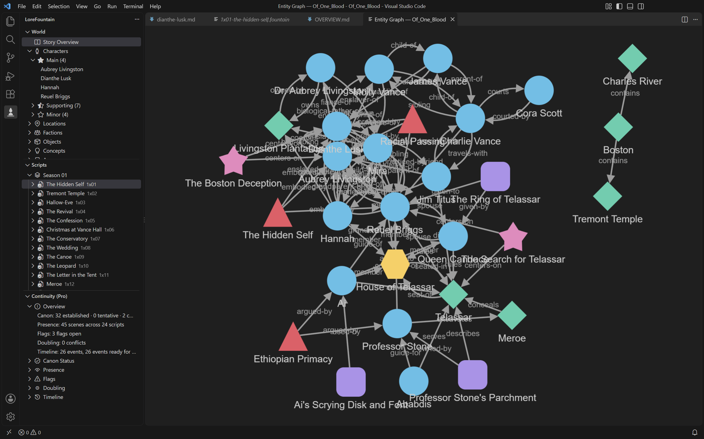

# LoreFountain

A Fountain-native worldbuilding layer for VS Code (and VS Code forks: Cursor,
Windsurf, Antigravity). LoreFountain links character cues and scene headings in
`.fountain` scripts to structured, plain-Markdown **entity** files — characters,
locations, factions, objects, concepts, and arcs — with typed relationships,
hover previews, autocomplete, and backlinks.

## Install

- **VS Code:** open the Extensions view, search for **LoreFountain**, and click Install (or press `Ctrl+P` and run `ext install All-Stone-Tech.lorefountain`).
- **Cursor, Windsurf, Antigravity, VSCodium:** these editors use the [Open VSX Registry](https://open-vsx.org); search for **LoreFountain** in their Extensions view.
- **From a file:** download the `.vsix` from the [latest release](https://github.com/AllStoneTech/lorefountain/releases/latest), then Extensions view → the `...` menu → **Install from VSIX...**.

LoreFountain needs VS Code 1.125 or newer and works on a local folder (it reads and writes your project's files, so it doesn't run in virtual workspaces like vscode.dev).

## Getting started

1. **Look around a finished project first.** Run **LoreFountain: Try LoreFountain (Sample Workspace)** from the Command Palette (`Ctrl+Shift+P`) for a small sample, or **LoreFountain: Install Demo World...** for a full-length one. Both open in a new window and never touch your current folder.
2. **Or start your own.** Open an empty folder (or one with `.fountain` scripts in it) and run **LoreFountain: Initialize Workspace**. It creates `world/`, `scripts/`, `imports/`, and `assets/`, plus a short README in each explaining what it's for.
3. **Create your first entity.** Open the LoreFountain view in the Activity Bar and use **New Character** (or Location, Faction, Object, Concept, Arc). Each entity is a plain Markdown file that opens as a form — a *Story Card* — instead of raw YAML.

   
4. **Link it into a script.** Type a character's name in a `.fountain` script, in a cue or in dialogue, or write `[[Their Name]]` anywhere. Hover it for the Story Card, or autocomplete the name as you type.

   
5. **Keep going.** Rename an entity and every reference follows (**Rename Entity**), find every scene two characters share (**Structured Search**), track when things happen on the Timeline, and write the premise once in the **Story Overview**.

   
6. **Bring your existing notes.** Drop old bibles and outlines into `imports/`, then run **LoreFountain: Migrate Existing Lore** to hand a ready-made prompt to whichever AI coding agent you use. LoreFountain never modifies `imports/` itself.

**Keeping current.** **Check for LoreFountain Updates** tells you when a newer release exists (Marketplace and Open VSX installs also update on their own). **Check for LoreFountain File Updates** compares a project's scaffolded agent instructions and READMEs against the versions bundled with your installed extension, offers to create any that are missing, and lets you review each change before anything is written.

## Principles

- **Files are the source of truth.** Scripts are `.fountain`; entities are `.md`
  with YAML frontmatter. No feature requires data that lives only in a database.
- **The index is disposable.** A local SQLite database is a rebuildable cache,
  never authoritative — it's git-ignored and safe to delete and re-index.
- **No AI features in the extension.** LoreFountain structures your data so the
  AI coding agent already in your IDE works better with it; it doesn't compete
  with them.

## What's included

The free tier covers the whole worldbuilding workflow: the entity model
(character, location, faction, object, concept, arc) with typed relationships
and significance grouping, a glossary, a dual-ordered Timeline, a Story Card
editor and Story Overview document, hover previews and autocomplete, Rename
Entity with reference propagation, Structured Search, broken-reference
detection, transcript export, and project-level AI agent instructions
(`AGENTS.md`/`agents/*.md`). There's also a headless `validate.js` for
CI or AI-agent use with no VS Code dependency.

Cues (`SFX:`/`MUSIC:`/`AMB:`) can carry an optional `[tag]`, and entities
can have production assets (audio, character/location/object rigs) mapped
to them by id — both through a form-based **Asset Manifest editor** under
`assets/manifests/` — so a recurring sound, likeness, or set condition is
reused every time it recurs across a season instead of re-picked or
regenerated.

**LoreFountain Pro** adds Continuity Management, an Entity Graph view,
Story-Bible Export, BBC Radio Drama Export, SFX/Cue-Sheet Export, and Shot
List Export. Pro is unlocked for everyone during the public launch promo —
no license key needed until then. See `CHANGELOG.md` for release history.



## Telemetry & Feedback

LoreFountain can optionally share anonymous feature-usage data — which
commands and views you use, your license tier, extension version, and
editor/OS — to help prioritize development. **Off by default.** A one-time
prompt asks on first activation; you can also toggle it any time via the
`lorefountain.telemetry.enabled` setting, and it's always subject to VS
Code's own global telemetry switch, which takes priority regardless of this
setting.

Never included, ever: file names, entity names, workspace paths, search
queries, or file contents. Run **LoreFountain: Show Telemetry Queue** to see
exactly what's queued to send, unredacted, before it goes anywhere. Run
**LoreFountain: Disable Telemetry** to turn it off and clear the queue.

**LoreFountain: Send Feedback** opens a small form for bugs, feature
suggestions, or general thoughts — independent of the telemetry setting,
since it's something you choose to send each time rather than background
usage tracking.

## Development

Requires Node.js and npm.

```bash
npm install
npm run build      # bundle to dist/ via esbuild
npm run watch      # incremental rebuilds
npm run typecheck  # tsc --noEmit
npm run lint       # eslint
npm run test:unit  # vitest (pure-logic tests)
```

Press <kbd>F5</kbd> in VS Code to launch the **Run Extension** configuration in
an Extension Development Host.

See [CONTRIBUTING.md](CONTRIBUTING.md) for the full contributor guide,
including what a good pull request looks like here and how production builds
are packaged/obfuscated.

## Support

If LoreFountain saves you time, you can [buy us a cup of coffee](https://www.allstonetech.com/support?source=lorefountain) — it helps fund continued development.

## License

MIT © All Stone Tech. See [LICENSE](LICENSE). The Fountain parsing dependencies
(Afterwriting, Fountain.js) are likewise MIT-licensed.
